# MiniAxe LP build guide

## Before build
* Please be aware of injuries with soldering irons, tools, parts etc.
* When you leave your seat during work, please confirm that the soldering iron is turned off.
* Very small parts are included, so be careful not to lose.

### Restriction on Rev 1.0
PCB rev 1.0 does not formally support the Kailh low profile switch's clicky type (white axis). This is because there are no holes on the PCB to receive pins that exist only on the clicky type (white axis). Please be careful when choosing and purchasing a new switch.

If you already have a clicky type (white axis) and you can install it without interfering with the PCB, you can use it as it is, but please note that it is not a formally supported configuration.

## Confirm contents
The following parts are included in the kit. Please check whether there is any shortage before work.

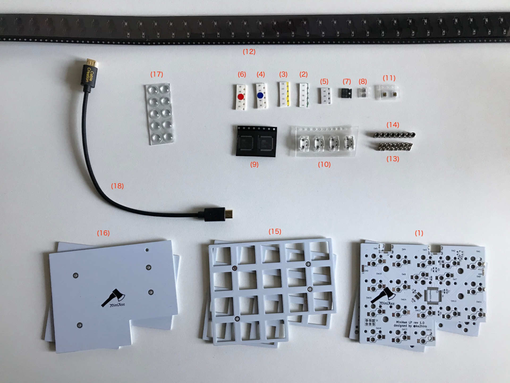

Number | Name | Value | Qty | Remarks | Place
:----|:--------|:-----|:----|:-----------------|:-------
1 | PCB | | 2 | 1 for left hand, 1 for right hand |
2 | Resistance | 10 kΩ | 5 | 1 spare, colored with green sticker or marker [1] (#marker), marked "103" on the package. | R1, R4
3 | Resistance | 22 Ω | 5 | 1 spare, colored with yellow sticker or marker [1] (#marker), marked "220" on the package. | R2, 
4 | Capacitor | 1 μF | 5 | 1 spare, colored with blue sticker or marker[1](#marker) | C1, C3
5 | Capacitor | 0.1 μF | 3 | 1 spare, no sticker or maker. | C2
6 | Capacitor | 22pF | 5 | 1 spare, colored with red sticker or marker[1](#marker) | C4, C5
7 | Schottky diode | | 2 | | D 1
8 | Crystal oscillator | 16 MHz | 2 | | Y 1
9 | MPU | ATMEGA 32 U 4 | 2 | | U1
10 | USB connector | Micro B female | 4 | | J 1, J 2
11 | Tact switch | | 2 | | SW 20
12 | Switch socket | | 36 | | SW1 - SW18
13 | M2 screw | 3 mm | 16 |
14 | M2 metal standoff | 3.5 mm | 8 |
15 | Top plate | | 2 |
16 | Bottom plate | | 2 |
17 | Rubber feet | | 10 |
18 | USB cable | | 1 | Connect between left and right. |

## Other required items
In order to complete the kit, the following parts must be prepared separately.

* Key switch (Kailh low profile type(Red, Brown) only support. White(clicky) is not supported)
* Key caps
* USB Micro B cable (for connection with PC)

## Required tools
In order to build, the following tools are required at minimum.

* Soldering iron (preferred temperature controllable)
* Lead solder
* Tweezers
* Phillips head screwdriver
* Magnifier
* Flux

In addition, you may also prepare the following as necessary.

* Flux remover
* Solder wick
* Multimeter

# Buid procedure

For the soldered kit, proceed with building from the item [Verify that it is recognized as a USB device](#verify-that-it-is-recognized-as-a-usb-device).

## Solder MPUs
1. Place the ● mark (pin 1 marking) on the MPU aligned with the ○ mark on the board.
2. Make sure that all pins are on the pad and solder them.

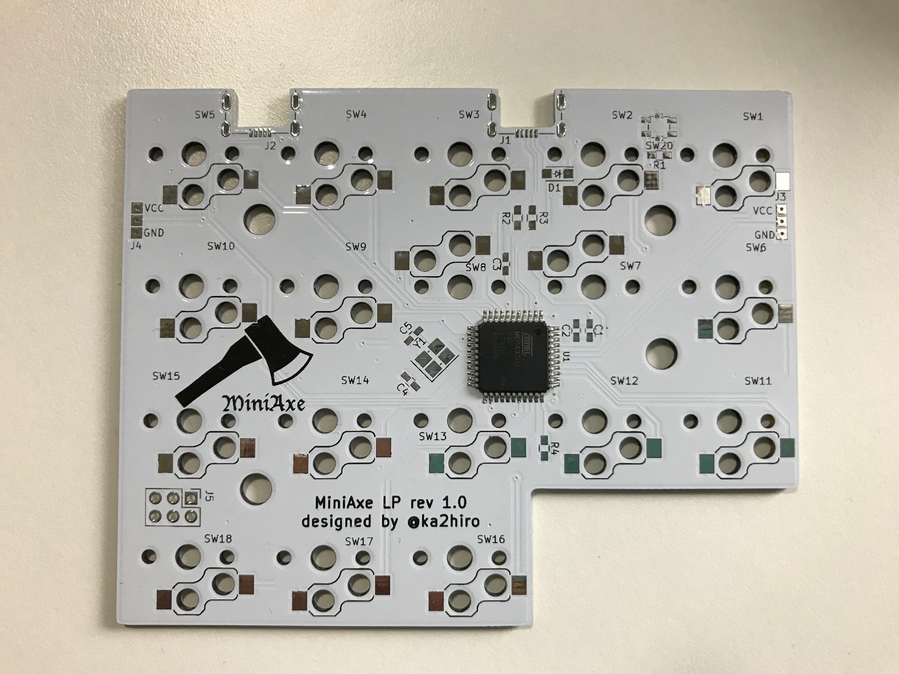

For the QFP package soldering, this [movie] (https://www.youtube.com/watch?v=-8SRkSjkZ8A) may be helpful.

## Solder crystal oscilators
1. Align the long side of the crystal oscillator (which may be either long side) so that it comes to the position of the part number (Y1) on the board and place it at the center of the four pads.
2. Since the terminal can be seen only a little at the corner of the crystal oscillator, solder is poured while warming it at the tip of the crystal.

This [movie] (https://www.youtube.com/watch?v=14fJTgFg03M) may be helpful for soldering SMD crystal oscillator.

## Solder resisters
1. Solder resistors R1 to R4. Since the parts are really small, you will lose sight of it quickly, so please be careful. When soldering, remove them one at a time from the tape.

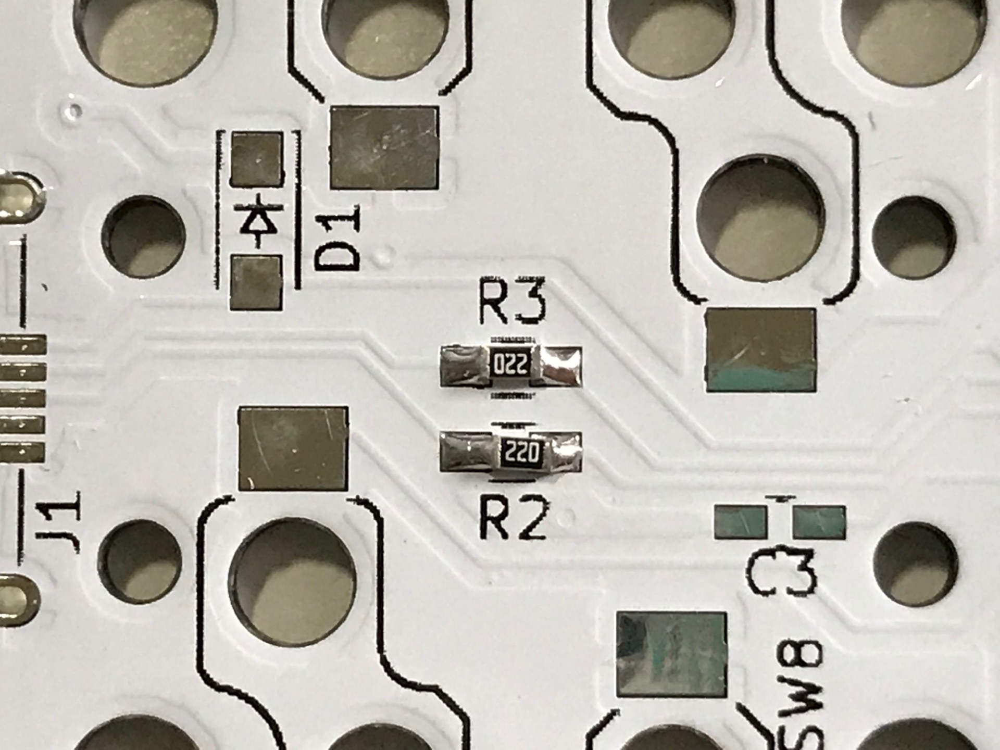

## Solder capacitors
1. Solder capacitors C1 to C5. Since numerical values and letters are not written on the parts themselves, it is impossible to distinguish them by appearance when mixed with different values. When soldering, please remove one at a time from the tape.

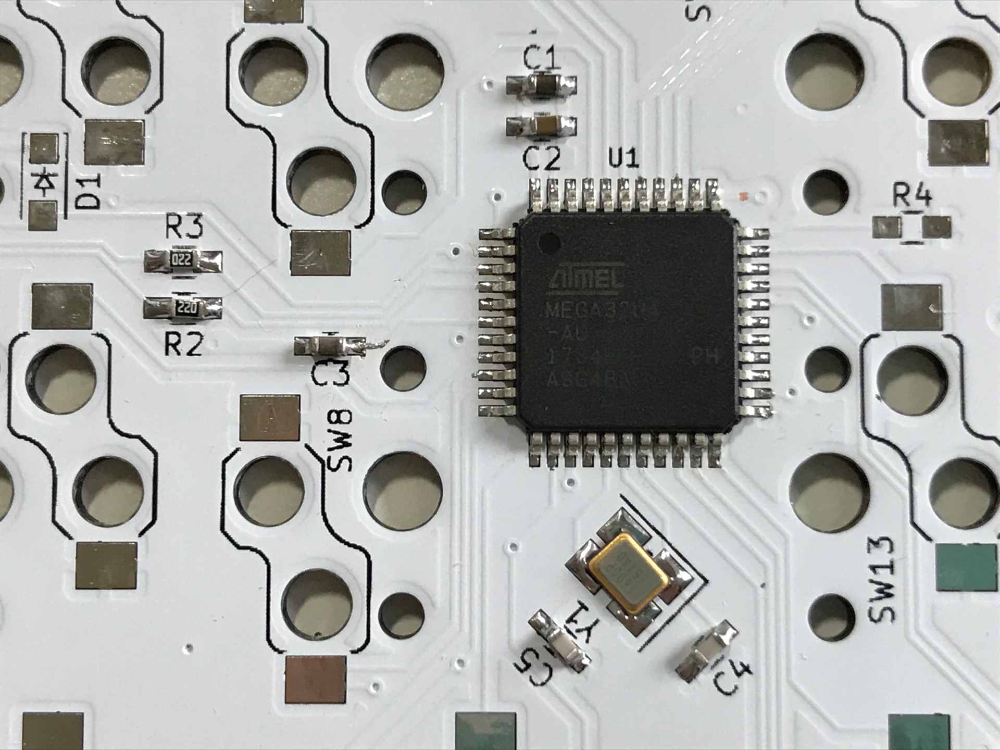

## Solder schottky diodes
1. The diode has a mounting orientation. Align the part of one side of the package that is painted white and bandlike to the position of the vertical bar of the diode symbol on the board.

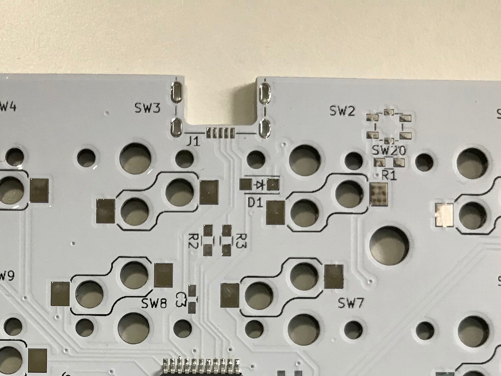
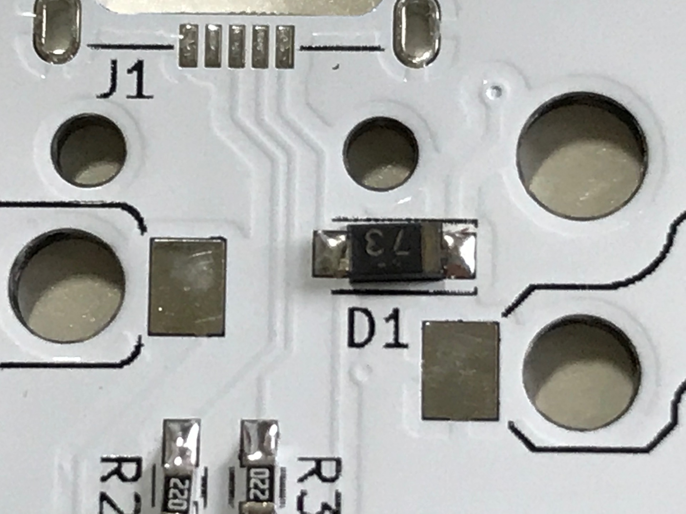

## Solder USB connectors
1. If soldering from the pin part first rather than the outer through hole part, it can be installed without misalignment.

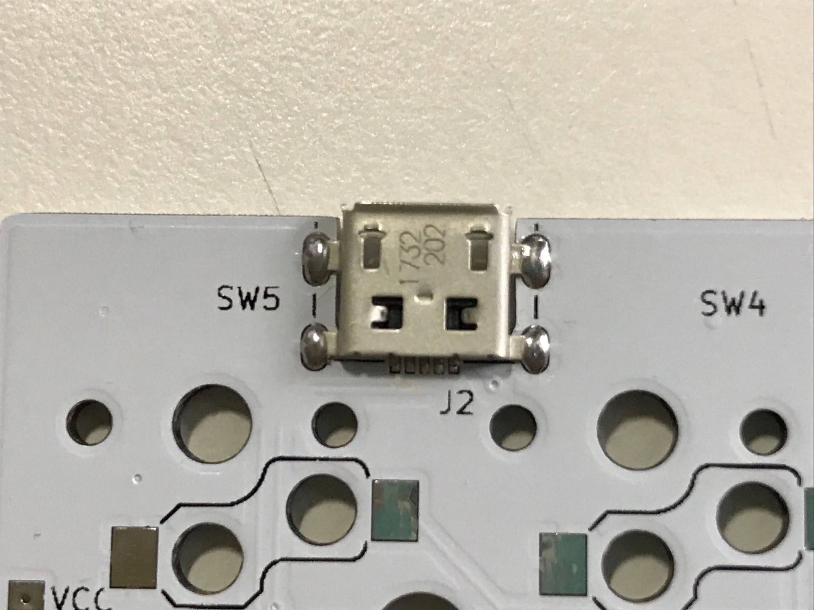

## Solder tact switches
1. Since the tactile switch has a little metallic part on the side, apply a soldering iron to that part and let the solder flow.

## Solder sockets
1. _Be careful because there are 2 places (SW 7, SW 8) in the center of the PCB where the direction to attach the socket is different from the others._
2. If you install it in the wrong direction, the hole in the middle where the key switch is attached will be blocked.
3. First, solder only one side of all the sockets, then check if they are misdirected, then solder the rest, it will be hard to fail.

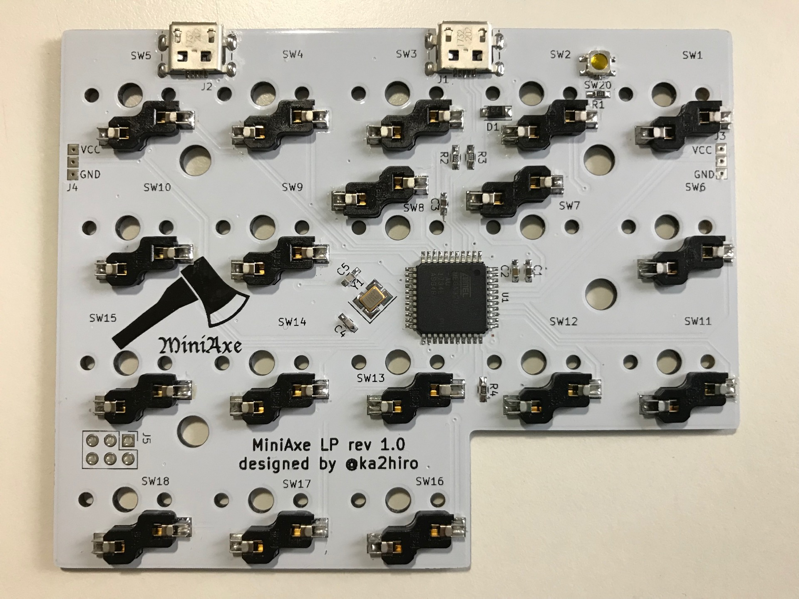

## Check whether the soldering is properly done
Refer to the schematic ([left side](files/MiniAxeLeft.pdf), [right side](files/MiniAxeRight.pdf)) and check whether soldering is correctly done.

Before connecting to the computer, at least check the followings.

1. Check that there is no short circuit between UVCC - GND and VCC - GND.
2. Make sure the MPU pins are not bridged.
4. Make sure the USB connector pins are not bridged.

## Verify that it is recognized as a USB device
Connect the keyboard to the computer and confirm that it is recognized as a USB device.

* For Mac, start "System Information" and check whether the device named "ATm32U4DFU" is visible.

* For Windows, start "Device Manager" and check whether the device named "ATm32U4DFU" is visible.

If it is not recognized as a USB device, please double check the schematic to see if all parts are properly soldered.

## Assemble the top plate
1. Insert M2 x 3mm screws into the top plate and fix screws with a masking tape.
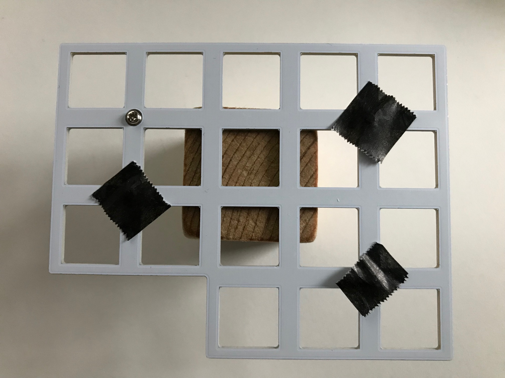
2. Turn the top plate over and attach metal standoffs.
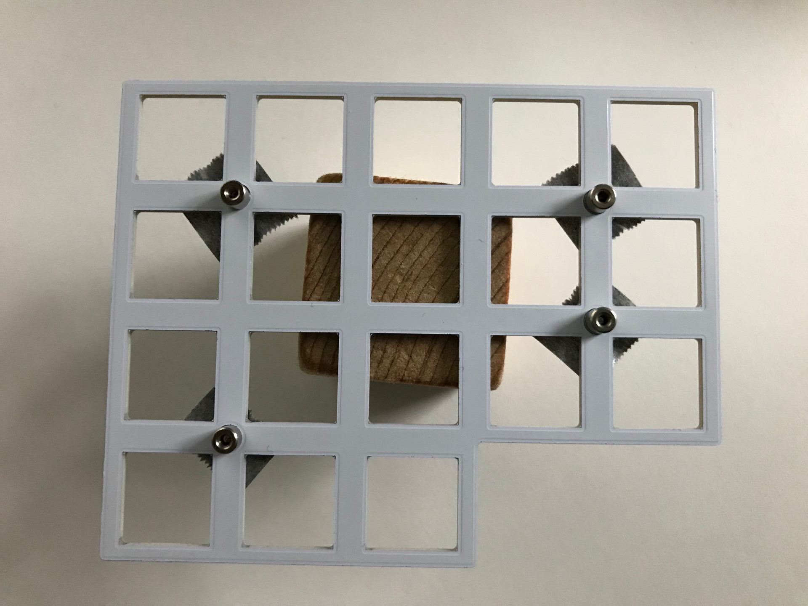
3. Combine with the PCB.
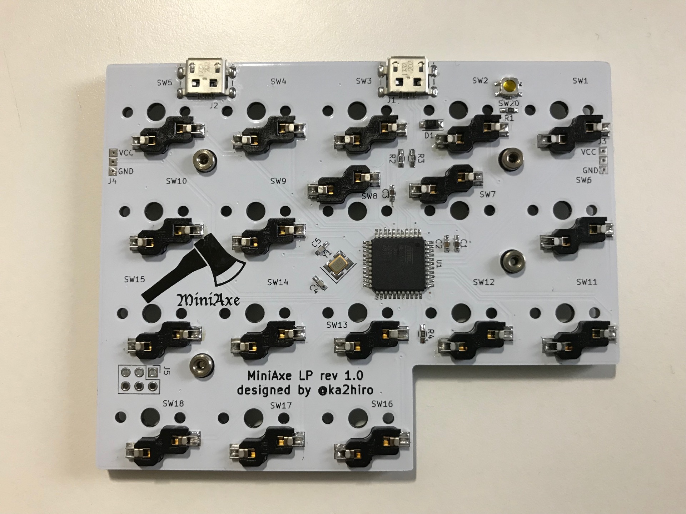

## Assemble the bottom plate
1. Insert the M3 x 3mm screw into the bottom plate, select the diagonal screw with respect to the metal standoff on the PCB (in the order of upper left → lower right → upper right → lower left etc.) and tighten evenly and gradually. _If tightening tightly one by one, the last screw may not be tightened._
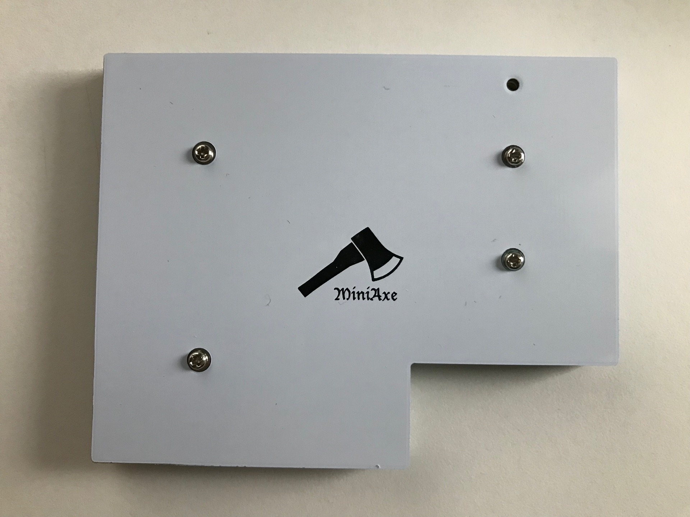

## Attach rubber feet
1. Attach the rubber feet on the bottom plate.
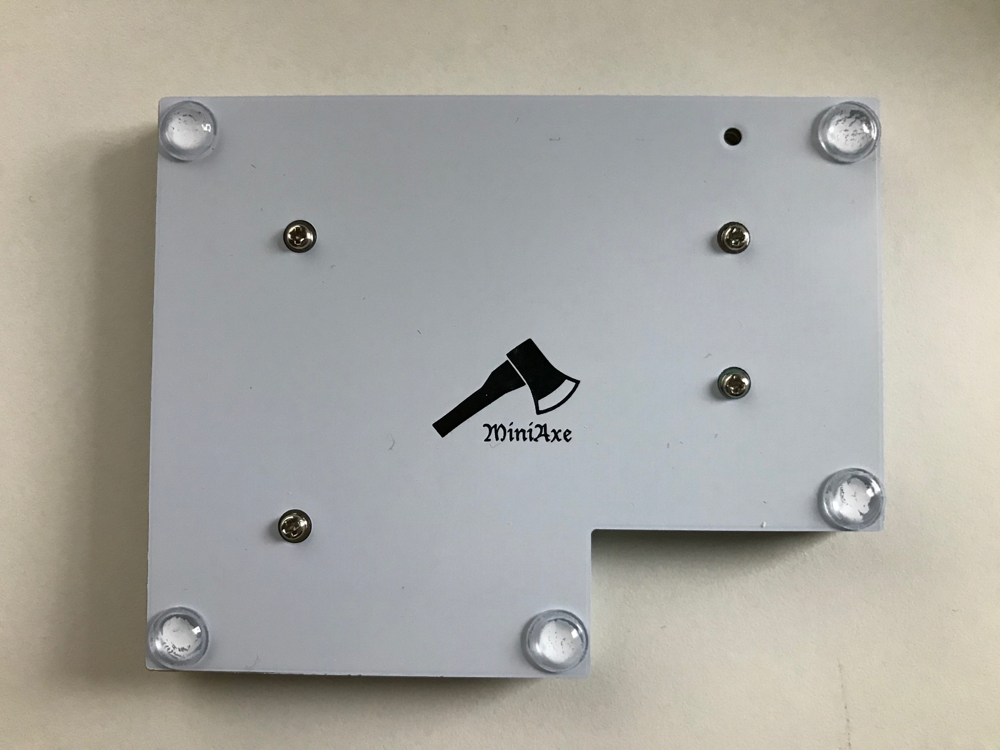

## Install key switches and key caps
1. Install the keySwitchAnd key cap of your choice. (_Only  Kailh low profile switch is supported, please note that Cherry MX compatible type is not supported._)
2. _Since the pin of the key switch is easy to bend, please make sure that it is straight. Also, be carefull as SW7 and SW8 are oriented opposite to the otherrs._)

## Write firmware
The firmware uses QMK. Please clone the following repository.

[qmk_firmware](https://github.com/qmk/qmk_firmware)

After cloning, move to the directory of the local repository and execute the following command, the standby state will be entered to write the firmware, please connect the keyboard. If the keyboard is already connected, writing will begin.

~~~
$ make miniaxe: default: dfu
~~~

It is not necessary to press the reset switch to write the firmware for the first time.

Please refer to [this document](https://docs.qmk.fm/#/getting_started_build_tools) for building the environment for building firmware.

## Completed!
Congratulation!

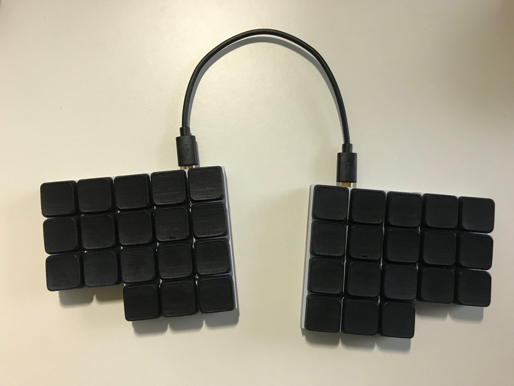

---

<a name="marker">1</a>: Some kits are colored with markers. 

